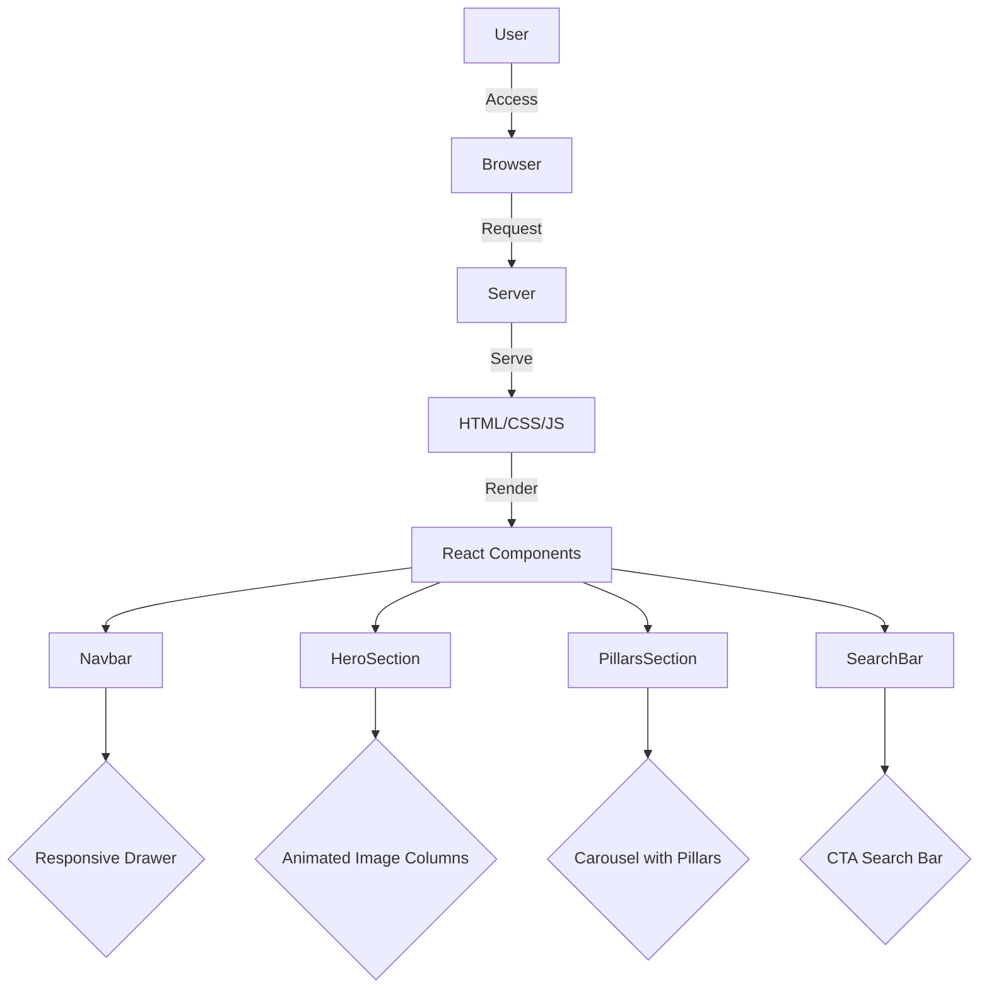

# Proactively-provital – Elevate Your Lifestyle Medicine Experience

 

## Overview

Proactively-provital is a sleek, marketing-style landing page built with React and Vite, designed to showcase lifestyle medicine services. Featuring animated visuals and an intuitive user interface, it aims to enhance user engagement and promote the six pillars of lifestyle health.

## Architecture & Workflow

The application is structured as a single-page application (SPA) using React components and Vite for fast development and hot module replacement. The architecture emphasizes modularity and reusability with a focus on responsive design and accessibility.



## Granular Tech Stack

- **Languages**: JavaScript, SCSS
- **Frameworks & Libraries**: React 19, Vite 6
- **Tools**: ESLint 9 with React hooks and refresh plugins
- **Build System**: Vite for development and production builds

## Key Features

- **Responsive Design**: Adaptive layout with mobile-first approach.
- **Animated Visuals**: Engaging image columns and smooth transitions.
- **Interactive Navigation**: Dropdowns and mobile-friendly drawer.
- **Carousel**: Scroll-snapping for seamless content exploration.
- **Theming**: Global SCSS modules for consistent styling.
- **Accessibility**: ARIA labels and keyboard navigation support.

## Project Structure

```plaintext
.
├── public/
│   └── vite.svg
├── src/
│   ├── App.css
│   ├── App.jsx
│   ├── assets/
│   │   ├── img1.png
│   │   ├── img2.png
│   │   └── ... (more images)
│   ├── components/
│   │   ├── AnimatedImageColumns.jsx
│   │   ├── GradientBar.jsx
│   │   ├── HeroSection.jsx
│   │   ├── Navbar.jsx
│   │   ├── PillarsSection.jsx
│   │   └── SearchBar.jsx
│   ├── styles/
│   │   ├── App.scss
│   │   └── global.scss
│   ├── index.css
│   └── main.jsx
├── index.html
├── package.json
└── vite.config.js
```

## Getting Started

### Prerequisites

- Node.js (v14 or higher)
- npm (v6 or higher)

### Installation

```bash
# Clone the repository
git clone https://github.com/yourrepo/proactively-provital.git
cd proactively-provital

# Install dependencies
npm install
```

### Running the Project

```bash
# Start the development server
npm run dev

# Build for production
npm run build

# Preview the production build
npm run preview

# Run ESLint
npm run lint
```

## Usage

To explore the features, access the landing page at `http://localhost:5173` after starting the development server. Interact with the navigation, hero section, and carousel to experience the full functionality.

## Roadmap

- **Enhanced Accessibility**: Further improvements to ARIA support and keyboard navigation.
- **SEO Optimization**: Implement meta tags and structured data for better search engine visibility.
- **Performance Enhancements**: Explore code-splitting and lazy loading for optimized load times.
- **Additional Animations**: Introduce more dynamic transitions and effects.

## Contributing

We welcome contributions! Please fork the repository and submit a pull request for any enhancements or bug fixes.

## License

This project is licensed under the MIT License. See the [LICENSE](LICENSE) file for details.
